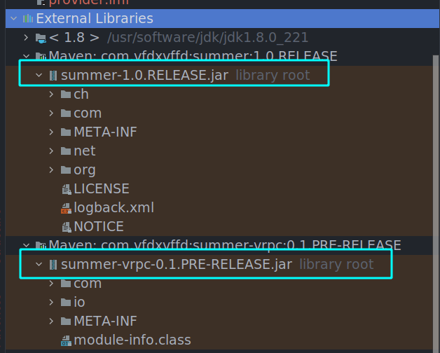
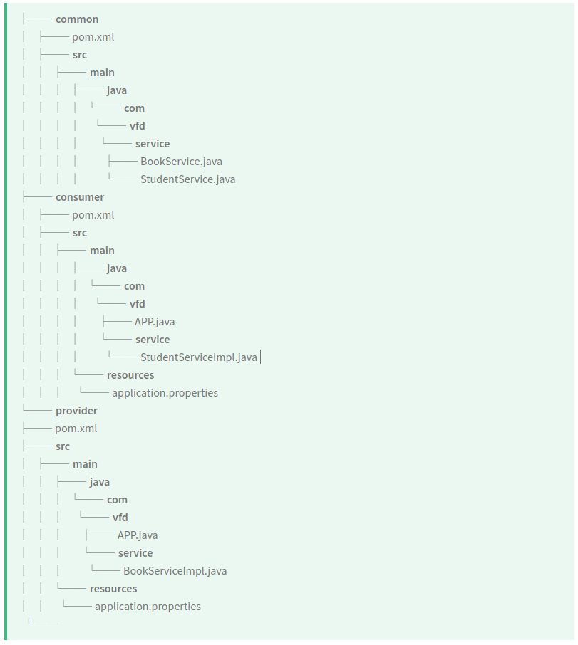
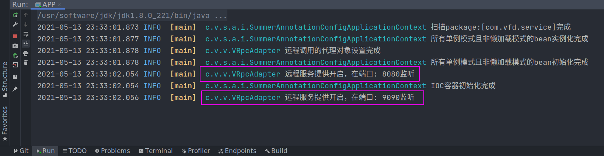
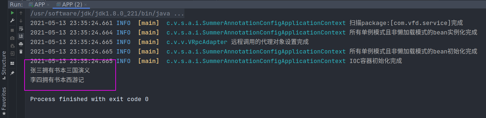

# 快速开始(Quick Start)

## 加入依赖

- 对照`版本兼容`表格，下载兼容的`Summer`和`summer-vrpc`的jar包，将其同时导入项目中

或者

- 在本地构建项目，安装在本地maven中（可以使用`install`插件），使用坐标引入项目



## 搭建项目

构建一个多模块的项目，三个模块，一个`common`模块负责管理公共的接口；一个`provider`模块负责当服务提供者角色；一个`comsumer`模块负责当服务消费者的角色；`provider`和`consumer`的父模块是`common`。项目树状图如下：（已忽略部分不重要的分支）



在`common`模块定义公共的两个接口`BookService`和`StudentService`

```java
public interface BookService {
    String getBook (String ISBN);
}
```

```java
public interface StudentService {
    void getStudent (String name);
}
```

## 服务提供者模块

我们让`provider`模块实现`BookService`接口

```java
import com.vfd.summer.ioc.annotation.Service;

@Service	// 标注@Service注解将其交由IOC容器管理
public class BookServiceImpl implements BookService {
    public String getBook(String ISBN) {
        if ("a-1".equals(ISBN)) {
            System.out.println("三国演义");
            return "三国演义";
        } else if ("a-2".equals(ISBN)){
            System.out.println("西游记");
            return "西游记";
        } else {
            System.out.println("错误的书籍码");
            return "error";
        }
    }
}
```

并且让`provider`模块向外提供服务，还要配置服务提供者监听的端口，在类路径下新建文件`application.properties`

```properties
summer.rpc.server.provide=true		# 开启提供服务
summer.rpc.server.port=8080			# 服务提供者监听在8080端口
```

正式开启服务提供

```java
import com.vfd.summer.applicationContext.ApplicationContext;
import com.vfd.summer.applicationContext.impl.SummerAnnotationConfigApplicationContext;
import com.vfd.vrpc.VRpcAdapter;
import com.vfd.vrpc.VRpcHandler;

import java.util.Collections;

public class APP {
    public static void main(String[] args) throws Exception {
        /**
         * 对三个参数的解释：
         * @param propertyFile 表示配置文件的位置
         * @param extensions 表示外部扩展的主类对象列表，对于vrpc框架就是VRpcAdapter.class.newInstance()即可
         * @param basePackages 由Summer框架扫描的包，传入一个可变参数列表
         */
        ApplicationContext ioc = new SummerAnnotationConfigApplicationContext(
               "/application.properties" , Collections.singletonList(VRpcAdapter.class.newInstance()), "com.vfd.service"
        );		//这句执行完后服务提供者就已经开始监听端口了
        
        // 还可以通过ioc容器获得VRpcHandler，以获取更多对本机和其他机器的连接的控制
        final VRpcHandler handler = ioc.getBean(VRpcHandler.class);
        // 还可以通过handler开启一个服务提供者，现在和配置文件里的一起就有两个服务提供者分别监听8080和9090
        handler.startProvideServer(9090);
    }
}
```

**另外，服务提供者本身就是一个服务消费者！！！**

启动主类服务



## 服务消费者模块

让`consumer`模块实现`StudentService`接口

```java
import com.vfd.summer.ioc.annotation.Autowired;
import com.vfd.summer.ioc.annotation.Lazy;
import com.vfd.summer.ioc.annotation.Service;
import com.vfd.vrpc.VRpcHandler;
import com.vfd.vrpc.annotation.Reference;

@Service
public class StudentServiceImpl implements StudentService {

    @Reference(host = "127.0.0.1", port = 8080)	
    BookService bookService1;	// 需要远程调用，远程服务提供者的地址是127.0.0.1:8080

    @Reference(host = "127.0.0.1", port = 9090)
    BookService bookService2;	// 需要远程调用，远程服务提供者的地址是127.0.0.1:9090

    @Autowired
    VRpcHandler handler;	// 操作管理连接的句柄

    public void getStudent(String name) {
        handler.keepNonAlive();		// 将连接设置为短连接，每次请求完成后都关闭连接，下次请求再重新连接
        // 下面分别调用两个远程调用的service
        if ("zs".equals(name)) {
            System.out.println("张三拥有书本" + bookService1.getBook("a-1"));
        } else if ("ls".equals(name)) {
            System.out.println("李四拥有书本" + bookService2.getBook("a-2"));
        } else {
            System.out.println("error");
        }
    }
}
```

在主类中调用测试看是否能成功调用`BookService`

```java
import com.vfd.service.StudentService;
import com.vfd.summer.applicationContext.ApplicationContext;
import com.vfd.summer.applicationContext.impl.SummerAnnotationConfigApplicationContext;
import com.vfd.vrpc.VRpcAdapter;

import java.util.Collections;

public class APP {
    public static void main(String[] args) throws Exception {
        ApplicationContext ioc = new SummerAnnotationConfigApplicationContext(
            "/application.properties", Collections.singletonList(VRpcAdapter.class.newInstance()), "com.vfd.service"
        );
        
        // 通过ioc容器获取studentService,其内部调用了两个远程调用
        final StudentService studentService = ioc.getBean(StudentService.class);
        studentService.getStudent("zs");
        studentService.getStudent("ls");
    }
}
```

启动主类进行测试



## 更多可配置的项目

```properties
summer.rpc.dest.host						# 服务消费者引用远程调用的主机地址，@Reference中的优先级更高
summer.rpc.dest.port						# 服务消费者引用远程调用的主机端口，@Reference中的优先级更高
summer.rpc.dest.serializer				  # 服务消费者引用远程调用的消息序列化方式，以实现Serializer接口的实现类的全类名传入
summer.rpc.server.provide			# 是否开启服务提供者，即本机是否向外提供服务 true or false，默认false
summer.rpc.server.serializer			  # 服务提供者接收远程消费者消息的序列化方式，以实现Serializer接口的实现类的全类名传入
summer.rpc.server.port						# 本地服务提供者监听的端口
summer.rpc.message.maxLength			  # 远程调用过程中消息的最大长度，以字节为单位
summer.rpc.client.keepAlive				  # 引用远程调用的时候的连接采用长连接还是短连接 true or false
```